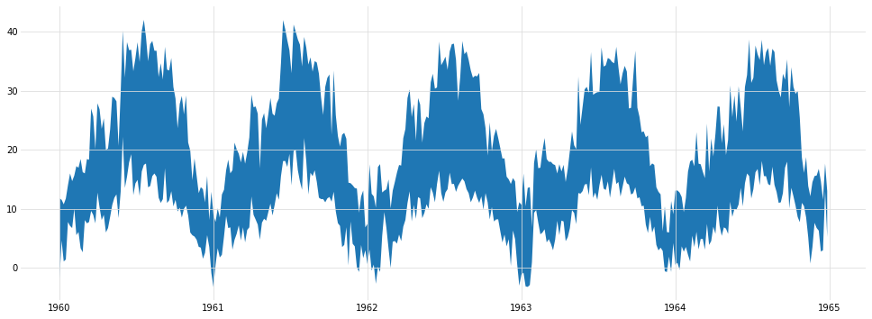

# An RNN model for temperature data
This time we will be working with real data: daily (Tmin, Tmax) temperature series from 36 weather stations spanning 50 years. It is to be noted that a pretty good predictor model already exists for temperatures: the average of temperatures on the same day of the year in N previous years. It is not clear if RNNs can do better but we will se how far they can go.


```python
!pip install tensorflow==1.15.3
```

    Collecting tensorflow==1.15.3
      Downloading tensorflow-1.15.3-cp37-cp37m-manylinux2010_x86_64.whl (110.5 MB)
         |████████████████████████████████| 110.5 MB 22 kB/s s eta 0:00:01
    [?25hRequirement already satisfied: protobuf>=3.6.1 in /opt/conda/lib/python3.7/site-packages (from tensorflow==1.15.3) (3.13.0)
    Requirement already satisfied: keras-preprocessing>=1.0.5 in /opt/conda/lib/python3.7/site-packages (from tensorflow==1.15.3) (1.1.2)
    Collecting gast==0.2.2
      Downloading gast-0.2.2.tar.gz (10 kB)
    Collecting keras-applications>=1.0.8
      Downloading Keras_Applications-1.0.8-py3-none-any.whl (50 kB)
         |████████████████████████████████| 50 kB 10.1 MB/s eta 0:00:01
    [?25hCollecting tensorflow-estimator==1.15.1
      Downloading tensorflow_estimator-1.15.1-py2.py3-none-any.whl (503 kB)
         |████████████████████████████████| 503 kB 81.2 MB/s eta 0:00:01
    [?25hRequirement already satisfied: grpcio>=1.8.6 in /opt/conda/lib/python3.7/site-packages (from tensorflow==1.15.3) (1.31.0)
    Collecting tensorboard<1.16.0,>=1.15.0
      Downloading tensorboard-1.15.0-py3-none-any.whl (3.8 MB)
         |████████████████████████████████| 3.8 MB 25.1 MB/s eta 0:00:01
    [?25hRequirement already satisfied: wheel>=0.26; python_version >= "3" in /opt/conda/lib/python3.7/site-packages (from tensorflow==1.15.3) (0.35.1)
    Requirement already satisfied: numpy<2.0,>=1.16.0 in /opt/conda/lib/python3.7/site-packages (from tensorflow==1.15.3) (1.18.5)
    Collecting astor>=0.6.0
      Downloading astor-0.8.1-py2.py3-none-any.whl (27 kB)
    Requirement already satisfied: termcolor>=1.1.0 in /opt/conda/lib/python3.7/site-packages (from tensorflow==1.15.3) (1.1.0)
    Requirement already satisfied: wrapt>=1.11.1 in /opt/conda/lib/python3.7/site-packages (from tensorflow==1.15.3) (1.12.1)
    Requirement already satisfied: six>=1.10.0 in /opt/conda/lib/python3.7/site-packages (from tensorflow==1.15.3) (1.15.0)
    Requirement already satisfied: absl-py>=0.7.0 in /opt/conda/lib/python3.7/site-packages (from tensorflow==1.15.3) (0.8.1)
    Requirement already satisfied: opt-einsum>=2.3.2 in /opt/conda/lib/python3.7/site-packages (from tensorflow==1.15.3) (3.3.0)
    Requirement already satisfied: google-pasta>=0.1.6 in /opt/conda/lib/python3.7/site-packages (from tensorflow==1.15.3) (0.2.0)
    Requirement already satisfied: setuptools in /opt/conda/lib/python3.7/site-packages (from protobuf>=3.6.1->tensorflow==1.15.3) (49.6.0.post20200814)
    Requirement already satisfied: h5py in /opt/conda/lib/python3.7/site-packages (from keras-applications>=1.0.8->tensorflow==1.15.3) (2.10.0)
    Requirement already satisfied: werkzeug>=0.11.15 in /opt/conda/lib/python3.7/site-packages (from tensorboard<1.16.0,>=1.15.0->tensorflow==1.15.3) (1.0.1)
    Requirement already satisfied: markdown>=2.6.8 in /opt/conda/lib/python3.7/site-packages (from tensorboard<1.16.0,>=1.15.0->tensorflow==1.15.3) (3.2.2)
    Requirement already satisfied: importlib-metadata; python_version < "3.8" in /opt/conda/lib/python3.7/site-packages (from markdown>=2.6.8->tensorboard<1.16.0,>=1.15.0->tensorflow==1.15.3) (1.7.0)
    Requirement already satisfied: zipp>=0.5 in /opt/conda/lib/python3.7/site-packages (from importlib-metadata; python_version < "3.8"->markdown>=2.6.8->tensorboard<1.16.0,>=1.15.0->tensorflow==1.15.3) (3.1.0)
    Building wheels for collected packages: gast
      Building wheel for gast (setup.py) ... [?25ldone
    [?25h  Created wheel for gast: filename=gast-0.2.2-py3-none-any.whl size=7540 sha256=f20394b80395f86556e7278ce78a3677e5903c7fd5bf7fd296bf23def7c75552
      Stored in directory: /home/jupyter/.cache/pip/wheels/21/7f/02/420f32a803f7d0967b48dd823da3f558c5166991bfd204eef3
    Successfully built gast
    Installing collected packages: gast, keras-applications, tensorflow-estimator, tensorboard, astor, tensorflow
      Attempting uninstall: gast
        Found existing installation: gast 0.3.3
        Uninstalling gast-0.3.3:
          Successfully uninstalled gast-0.3.3
      Attempting uninstall: tensorflow-estimator
        Found existing installation: tensorflow-estimator 2.3.0
        Uninstalling tensorflow-estimator-2.3.0:
          Successfully uninstalled tensorflow-estimator-2.3.0
      Attempting uninstall: tensorboard
        Found existing installation: tensorboard 2.3.0
        Uninstalling tensorboard-2.3.0:
          Successfully uninstalled tensorboard-2.3.0
      Attempting uninstall: tensorflow
        Found existing installation: tensorflow 2.3.0
        Uninstalling tensorflow-2.3.0:
          Successfully uninstalled tensorflow-2.3.0
    ERROR: After October 2020 you may experience errors when installing or updating packages. This is because pip will change the way that it resolves dependency conflicts.
    
    We recommend you use --use-feature=2020-resolver to test your packages with the new resolver before it becomes the default.
    
    tfx 0.22.1 requires pyarrow<0.17,>=0.16, but you'll have pyarrow 1.0.1 which is incompatible.
    tfx-bsl 0.22.1 requires pyarrow<0.17,>=0.16.0, but you'll have pyarrow 1.0.1 which is incompatible.
    tensorflow-serving-api 2.3.0 requires tensorflow<3,>=2.3, but you'll have tensorflow 1.15.3 which is incompatible.
    tensorflow-probability 0.11.0 requires cloudpickle==1.3, but you'll have cloudpickle 1.5.0 which is incompatible.
    tensorflow-probability 0.11.0 requires gast>=0.3.2, but you'll have gast 0.2.2 which is incompatible.
    tensorflow-model-analysis 0.22.2 requires pyarrow<0.17,>=0.16, but you'll have pyarrow 1.0.1 which is incompatible.
    tensorflow-model-analysis 0.22.2 requires scipy==1.4.1; python_version >= "3", but you'll have scipy 1.5.2 which is incompatible.
    tensorflow-io 0.15.0 requires tensorflow<2.4.0,>=2.3.0, but you'll have tensorflow 1.15.3 which is incompatible.
    tensorflow-data-validation 0.22.2 requires joblib<0.15,>=0.12, but you'll have joblib 0.16.0 which is incompatible.
    tensorflow-data-validation 0.22.2 requires pyarrow<0.17,>=0.16, but you'll have pyarrow 1.0.1 which is incompatible.
    keras 2.4.0 requires tensorflow>=2.2.0, but you'll have tensorflow 1.15.3 which is incompatible.
    Successfully installed astor-0.8.1 gast-0.2.2 keras-applications-1.0.8 tensorboard-1.15.0 tensorflow-1.15.3 tensorflow-estimator-1.15.1


Please ignore any compatibility warnings and errors.
Make sure to <b>restart</b> your kernel to ensure this change has taken place.


```python
import math
import sys
import time
import numpy as np

sys.path.insert(0, 'temperatures/utils/') #so python can find the utils_ modules
import utils_batching
import utils_args

import tensorflow as tf
from tensorflow.python.lib.io import file_io as gfile
print("Tensorflow version: " + tf.__version__)
```

    Tensorflow version: 1.15.3


```python
from matplotlib import pyplot as plt
import utils_prettystyle
import utils_display
```

## Download Data


```bash
%%bash
DOWNLOAD_DIR=temperatures/data
mkdir $DOWNLOAD_DIR
gsutil -m cp gs://cloud-training-demos/courses/machine_learning/deepdive/09_sequence/temperatures/* $DOWNLOAD_DIR
```

    Copying gs://cloud-training-demos/courses/machine_learning/deepdive/09_sequence/temperatures/USC00025412.csv...
    Copying gs://cloud-training-demos/courses/machine_learning/deepdive/09_sequence/temperatures/USC00026132.csv...
    Copying gs://cloud-training-demos/courses/machine_learning/deepdive/09_sequence/temperatures/USC00033862.csv...
    Copying gs://cloud-training-demos/courses/machine_learning/deepdive/09_sequence/temperatures/USC00049742.csv...
    Copying gs://cloud-training-demos/courses/machine_learning/deepdive/09_sequence/temperatures/USW00014850.csv...
    Copying gs://cloud-training-demos/courses/machine_learning/deepdive/09_sequence/temperatures/USC00054452.csv...
    Copying gs://cloud-training-demos/courses/machine_learning/deepdive/09_sequence/temperatures/USC00055722.csv...
    Copying gs://cloud-training-demos/courses/machine_learning/deepdive/09_sequence/temperatures/USW00014840.csv...
    Copying gs://cloud-training-demos/courses/machine_learning/deepdive/09_sequence/temperatures/USC00087982.csv...
    Copying gs://cloud-training-demos/courses/machine_learning/deepdive/09_sequence/temperatures/USW00013960.csv...
    Copying gs://cloud-training-demos/courses/machine_learning/deepdive/09_sequence/temperatures/USC00091732.csv...
    Copying gs://cloud-training-demos/courses/machine_learning/deepdive/09_sequence/temperatures/USW00013880.csv...
    Copying gs://cloud-training-demos/courses/machine_learning/deepdive/09_sequence/temperatures/USW00014740.csv...
    Copying gs://cloud-training-demos/courses/machine_learning/deepdive/09_sequence/temperatures/USW00013740.csv...
    Copying gs://cloud-training-demos/courses/machine_learning/deepdive/09_sequence/temperatures/USW00013970.csv...
    Copying gs://cloud-training-demos/courses/machine_learning/deepdive/09_sequence/temperatures/USW00014820.csv...
    Copying gs://cloud-training-demos/courses/machine_learning/deepdive/09_sequence/temperatures/USW00003820.csv...
    Copying gs://cloud-training-demos/courses/machine_learning/deepdive/09_sequence/temperatures/USW00014750.csv...
    Copying gs://cloud-training-demos/courses/machine_learning/deepdive/09_sequence/temperatures/USW00013870.csv...
    Copying gs://cloud-training-demos/courses/machine_learning/deepdive/09_sequence/temperatures/USW00014860.csv...
    Copying gs://cloud-training-demos/courses/machine_learning/deepdive/09_sequence/temperatures/USW00014940.csv...
    Copying gs://cloud-training-demos/courses/machine_learning/deepdive/09_sequence/temperatures/USW00014950.csv...
    Copying gs://cloud-training-demos/courses/machine_learning/deepdive/09_sequence/temperatures/USW00023050.csv...
    Copying gs://cloud-training-demos/courses/machine_learning/deepdive/09_sequence/temperatures/USW00023160.csv...
    Copying gs://cloud-training-demos/courses/machine_learning/deepdive/09_sequence/temperatures/USW00023070.csv...
    Copying gs://cloud-training-demos/courses/machine_learning/deepdive/09_sequence/temperatures/USW00023170.csv...
    Copying gs://cloud-training-demos/courses/machine_learning/deepdive/09_sequence/temperatures/USW00024090.csv...
    Copying gs://cloud-training-demos/courses/machine_learning/deepdive/09_sequence/temperatures/USW00024130.csv...
    Copying gs://cloud-training-demos/courses/machine_learning/deepdive/09_sequence/temperatures/USW00024150.csv...
    Copying gs://cloud-training-demos/courses/machine_learning/deepdive/09_sequence/temperatures/USW00026410.csv...
    Copying gs://cloud-training-demos/courses/machine_learning/deepdive/09_sequence/temperatures/USW00026510.csv...
    Copying gs://cloud-training-demos/courses/machine_learning/deepdive/09_sequence/temperatures/USW00093720.csv...
    Copying gs://cloud-training-demos/courses/machine_learning/deepdive/09_sequence/temperatures/USW00093730.csv...
    Copying gs://cloud-training-demos/courses/machine_learning/deepdive/09_sequence/temperatures/USW00093820.csv...
    Copying gs://cloud-training-demos/courses/machine_learning/deepdive/09_sequence/temperatures/USW00094830.csv...
    Copying gs://cloud-training-demos/courses/machine_learning/deepdive/09_sequence/temperatures/USW00094910.csv...
    - [36/36 files][ 14.2 MiB/ 14.2 MiB] 100% Done                                  
    Operation completed over 36 objects/14.2 MiB.                                    


## Hyperparameters
N_FORWARD = 1: works but model struggles to predict from some positions<br/>
N_FORWARD = 4: better but still bad occasionnally<br/>
N_FORWARD = 8: works perfectly 


```python
NB_EPOCHS = 5       # number of times the model sees all the data during training

N_FORWARD = 8       # train the network to predict N in advance (traditionnally 1)
RESAMPLE_BY = 5     # averaging period in days (training on daily data is too much)
RNN_CELLSIZE = 128  # size of the RNN cells
N_LAYERS = 2        # number of stacked RNN cells (needed for tensor shapes but code must be changed manually)
SEQLEN = 128        # unrolled sequence length
BATCHSIZE = 64      # mini-batch size
DROPOUT_PKEEP = 0.7 # probability of neurons not being dropped (should be between 0.5 and 1)
ACTIVATION = tf.nn.tanh # Activation function for GRU cells (tf.nn.relu or tf.nn.tanh)

JOB_DIR  = "checkpoints"
DATA_DIR = "temperatures/data"

# potentially override some settings from command-line arguments
if __name__ == '__main__':
    JOB_DIR, DATA_DIR = utils_args.read_args1(JOB_DIR, DATA_DIR)

ALL_FILEPATTERN = DATA_DIR + "/*.csv" # pattern matches all 1666 files  
EVAL_FILEPATTERN = DATA_DIR + "/USC000*2.csv" # pattern matches 8 files
# pattern USW*.csv -> 298 files, pattern USW*0.csv -> 28 files
print('Reading data from "{}".\nWrinting checkpoints to "{}".'.format(DATA_DIR, JOB_DIR))
```

    Reading data from "temperatures/data".
    Wrinting checkpoints to "checkpoints".


## Temperature data
This is what our temperature datasets looks like: sequences of daily (Tmin, Tmax) from 1960 to 2010. They have been cleaned up and eventual missing values have been filled by interpolation. Interpolated regions of the dataset are marked in red on the graph.


```python
all_filenames = gfile.get_matching_files(ALL_FILEPATTERN)
eval_filenames = gfile.get_matching_files(EVAL_FILEPATTERN)
train_filenames = list(set(all_filenames) - set(eval_filenames))

# By default, this utility function loads all the files and places data
# from them as-is in an array, one file per line. Later, we will use it
# to shape the dataset as needed for training.
ite = utils_batching.rnn_multistation_sampling_temperature_sequencer(eval_filenames)
evtemps, _, evdates, _, _ = next(ite) # gets everything

print('Pattern "{}" matches {} files'.format(ALL_FILEPATTERN, len(all_filenames)))
print('Pattern "{}" matches {} files'.format(EVAL_FILEPATTERN, len(eval_filenames)))
print("Evaluation files: {}".format(len(eval_filenames)))
print("Training files: {}".format(len(train_filenames)))
print("Initial shape of the evaluation dataset: " + str(evtemps.shape))
print("{} files, {} data points per file, {} values per data point"
      " (Tmin, Tmax, is_interpolated) ".format(evtemps.shape[0], evtemps.shape[1],evtemps.shape[2]))
```

    Loading 8 files........
    Pattern "temperatures/data/*.csv" matches 36 files
    Pattern "temperatures/data/USC000*2.csv" matches 8 files
    Evaluation files: 8
    Training files: 28
    Initial shape of the evaluation dataset: (8, 18262, 3)
    8 files, 18262 data points per file, 3 values per data point (Tmin, Tmax, is_interpolated) 


```python
# You can adjust the visualisation range and dataset here.
# Interpolated regions of the dataset are marked in red.
WEATHER_STATION = 0 # 0 to 7 in default eval dataset
START_DATE = 0      # 0 = Jan 2nd 1950
END_DATE = 18262    # 18262 = Dec 31st 2009
visu_temperatures = evtemps[WEATHER_STATION,START_DATE:END_DATE]
visu_dates = evdates[START_DATE:END_DATE]

utils_display.picture_this_4(visu_temperatures, visu_dates)
```


## Resampling
Our RNN would need ot be unrolled across 365 steps to capture the yearly temperature cycles. That's a bit too much. We will resample the temparatures and work with 5-day averages for example. This is what resampled (Tmin, Tmax) temperatures look like.


```python
# This time we ask the utility function to average temperatures over 5-day periods (RESAMPLE_BY=5)
ite = utils_batching.rnn_multistation_sampling_temperature_sequencer(eval_filenames, RESAMPLE_BY, tminmax=True)
evaltemps, _, evaldates, _, _ = next(ite)
```

    Loading 8 files........


```python
# display five years worth of data
WEATHER_STATION = 0              # 0 to 7 in default eval dataset
START_DATE = 0                   # 0 = Jan 2nd 1950
END_DATE = 365*5//RESAMPLE_BY    # 5 years
visu_temperatures = evaltemps[WEATHER_STATION, START_DATE:END_DATE]
visu_dates = evaldates[START_DATE:END_DATE]
plt.fill_between(visu_dates, visu_temperatures[:,0], visu_temperatures[:,1])
plt.show()
```





## Visualize training sequences
This is what the neural network will see during training.


```python
# The function rnn_multistation_sampling_temperature_sequencer puts one weather station per line in
# a batch and continues with data from the same station in corresponding lines in the next batch.
# Features and labels are returned with shapes [BATCHSIZE, SEQLEN, 2]. The last dimension of size 2
# contains (Tmin, Tmax).
ite = utils_batching.rnn_multistation_sampling_temperature_sequencer(eval_filenames,
                                                                     RESAMPLE_BY,
                                                                     BATCHSIZE,
                                                                     SEQLEN,
                                                                     N_FORWARD,
                                                                     nb_epochs=1,
                                                                     tminmax=True)

# load 6 training sequences (each one contains data for all weather stations)
visu_data = [next(ite) for _ in range(6)]
```

    Loading 8 files........


```python
# Check that consecutive training sequences from the same weather station are indeed consecutive
WEATHER_STATION = 4
utils_display.picture_this_5(visu_data, WEATHER_STATION)
```


## The model definition

<div style="text-align: right; font-family: monospace">
  X shape [BATCHSIZE, SEQLEN, 2]<br/>
  Y shape [BATCHSIZE, SEQLEN, 2]<br/>
  H shape [BATCHSIZE, RNN_CELLSIZE*NLAYERS]
</div>
When executed, this function instantiates the Tensorflow graph for our model.


```python
def model_rnn_fn(features, Hin, labels, step, dropout_pkeep):
    X = features  # shape [BATCHSIZE, SEQLEN, 2], 2 for (Tmin, Tmax)
    batchsize = tf.shape(X)[0]
    seqlen = tf.shape(X)[1]
    pairlen = tf.shape(X)[2] # should be 2 (tmin, tmax)
    
    cells = [tf.nn.rnn_cell.GRUCell(RNN_CELLSIZE, activation=ACTIVATION) for _ in range(N_LAYERS)]
    # dropout useful between cell layers only: no output dropout on last cell
    cells = [tf.nn.rnn_cell.DropoutWrapper(cell, output_keep_prob = dropout_pkeep) for cell in cells]
    # a stacked RNN cell still works like an RNN cell
    cell = tf.nn.rnn_cell.MultiRNNCell(cells, state_is_tuple=False)
    # X[BATCHSIZE, SEQLEN, 2], Hin[BATCHSIZE, RNN_CELLSIZE*N_LAYERS]
    # the sequence unrolling happens here
    Yn, H = tf.nn.dynamic_rnn(cell, X, initial_state=Hin, dtype=tf.float32)
    # Yn[BATCHSIZE, SEQLEN, RNN_CELLSIZE]
    Yn = tf.reshape(Yn, [batchsize*seqlen, RNN_CELLSIZE])
    Yr = tf.layers.dense(Yn, 2) # Yr [BATCHSIZE*SEQLEN, 2]
    Yr = tf.reshape(Yr, [batchsize, seqlen, 2]) # Yr [BATCHSIZE, SEQLEN, 2]
    Yout = Yr[:,-N_FORWARD:,:] # Last N_FORWARD outputs Yout [BATCHSIZE, N_FORWARD, 2]
    
    loss = tf.losses.mean_squared_error(Yr, labels) # labels[BATCHSIZE, SEQLEN, 2]
    
    lr = 0.001 + tf.train.exponential_decay(0.01, step, 1000, 0.5)
    optimizer = tf.train.AdamOptimizer(learning_rate=lr)
    train_op = optimizer.minimize(loss)
    
    return Yout, H, loss, train_op, Yr
```

## Instantiate the model


```python
tf.reset_default_graph() # restart model graph from scratch

# placeholder for inputs
Hin = tf.placeholder(tf.float32, [None, RNN_CELLSIZE * N_LAYERS])
features = tf.placeholder(tf.float32, [None, None, 2]) # [BATCHSIZE, SEQLEN, 2]
labels = tf.placeholder(tf.float32, [None, None, 2]) # [BATCHSIZE, SEQLEN, 2]
step = tf.placeholder(tf.int32)
dropout_pkeep = tf.placeholder(tf.float32)

# instantiate the model
Yout, H, loss, train_op, Yr = model_rnn_fn(features, Hin, labels, step, dropout_pkeep)
```

    WARNING:tensorflow:From <ipython-input-13-560ff97d8615>:7: GRUCell.__init__ (from tensorflow.python.ops.rnn_cell_impl) is deprecated and will be removed in a future version.
    Instructions for updating:
    This class is equivalent as tf.keras.layers.GRUCell, and will be replaced by that in Tensorflow 2.0.
    WARNING:tensorflow:From <ipython-input-13-560ff97d8615>:11: MultiRNNCell.__init__ (from tensorflow.python.ops.rnn_cell_impl) is deprecated and will be removed in a future version.
    Instructions for updating:
    This class is equivalent as tf.keras.layers.StackedRNNCells, and will be replaced by that in Tensorflow 2.0.
    WARNING:tensorflow:From <ipython-input-13-560ff97d8615>:14: dynamic_rnn (from tensorflow.python.ops.rnn) is deprecated and will be removed in a future version.
    Instructions for updating:
    Please use `keras.layers.RNN(cell)`, which is equivalent to this API
    WARNING:tensorflow:From /opt/conda/lib/python3.7/site-packages/tensorflow_core/python/ops/rnn_cell_impl.py:559: Layer.add_variable (from tensorflow.python.keras.engine.base_layer) is deprecated and will be removed in a future version.
    Instructions for updating:
    Please use `layer.add_weight` method instead.
    WARNING:tensorflow:From /opt/conda/lib/python3.7/site-packages/tensorflow_core/python/ops/rnn_cell_impl.py:565: calling Constant.__init__ (from tensorflow.python.ops.init_ops) with dtype is deprecated and will be removed in a future version.
    Instructions for updating:
    Call initializer instance with the dtype argument instead of passing it to the constructor
    WARNING:tensorflow:From /opt/conda/lib/python3.7/site-packages/tensorflow_core/python/ops/rnn_cell_impl.py:575: calling Zeros.__init__ (from tensorflow.python.ops.init_ops) with dtype is deprecated and will be removed in a future version.
    Instructions for updating:
    Call initializer instance with the dtype argument instead of passing it to the constructor
    WARNING:tensorflow:From <ipython-input-13-560ff97d8615>:17: dense (from tensorflow.python.layers.core) is deprecated and will be removed in a future version.
    Instructions for updating:
    Use keras.layers.Dense instead.
    WARNING:tensorflow:From /opt/conda/lib/python3.7/site-packages/tensorflow_core/python/layers/core.py:187: Layer.apply (from tensorflow.python.keras.engine.base_layer) is deprecated and will be removed in a future version.
    Instructions for updating:
    Please use `layer.__call__` method instead.
    WARNING:tensorflow:From /opt/conda/lib/python3.7/site-packages/tensorflow_core/python/ops/losses/losses_impl.py:121: where (from tensorflow.python.ops.array_ops) is deprecated and will be removed in a future version.
    Instructions for updating:
    Use tf.where in 2.0, which has the same broadcast rule as np.where


## Initialize Tensorflow session
This resets all neuron weights and biases to initial random values


```python
# variable initialization
sess = tf.Session()
init = tf.global_variables_initializer()
sess.run([init])
saver = tf.train.Saver(max_to_keep=1)
```

## The training loop
You can re-execute this cell to continue training. <br/>
<br/>
Training data must be batched correctly, one weather station per line, continued on the same line across batches. This way, output states computed from one batch are the correct input states for the next batch. The provided utility function `rnn_multistation_sampling_temperature_sequencer` does the right thing.


```python
losses = []
indices = []
last_epoch = 99999
last_fileid = 99999

for i, (next_features, next_labels, dates, epoch, fileid) in enumerate(
    utils_batching.rnn_multistation_sampling_temperature_sequencer(train_filenames,
                                                                   RESAMPLE_BY,
                                                                   BATCHSIZE,
                                                                   SEQLEN,
                                                                   N_FORWARD,
                                                                   NB_EPOCHS, tminmax=True)):
    
    # reinintialize state between epochs or when starting on data from a new weather station
    if epoch != last_epoch or fileid != last_fileid:
        batchsize = next_features.shape[0]
        H_ = np.zeros([batchsize, RNN_CELLSIZE * N_LAYERS])
        print("State reset")

    #train
    feed = {Hin: H_, features: next_features, labels: next_labels, step: i, dropout_pkeep: DROPOUT_PKEEP}
    Yout_, H_, loss_, _, Yr_ = sess.run([Yout, H, loss, train_op, Yr], feed_dict=feed)
    
    # print progress
    if i%20 == 0:
        print("{}: epoch {} loss = {} ({} weather stations this epoch)".format(i, epoch, np.mean(loss_), fileid+1))
        sys.stdout.flush()
    if i%10 == 0:
        losses.append(np.mean(loss_))
        indices.append(i)
        
    last_epoch = epoch
    last_fileid = fileid
    
# save the trained model
SAVEDMODEL = JOB_DIR + "/ckpt" + str(int(time.time()))
tf.saved_model.simple_save(sess, SAVEDMODEL,
                           inputs={"features":features, "Hin":Hin, "dropout_pkeep":dropout_pkeep},
                           outputs={"Yout":Yout, "H":H})
```

    Loading 28 files............................
    State reset
    0: epoch 0 loss = 292.5794372558594 (28 weather stations this epoch)
    20: epoch 0 loss = 35.1979866027832 (28 weather stations this epoch)
    State reset
    40: epoch 1 loss = 22.54905128479004 (28 weather stations this epoch)
    State reset
    60: epoch 2 loss = 21.993322372436523 (28 weather stations this epoch)
    80: epoch 2 loss = 25.794050216674805 (28 weather stations this epoch)
    State reset
    100: epoch 3 loss = 22.328290939331055 (28 weather stations this epoch)
    State reset
    120: epoch 4 loss = 20.68770408630371 (28 weather stations this epoch)
    WARNING:tensorflow:From <ipython-input-16-dfd29d8a3ef5>:39: simple_save (from tensorflow.python.saved_model.simple_save) is deprecated and will be removed in a future version.
    Instructions for updating:
    This function will only be available through the v1 compatibility library as tf.compat.v1.saved_model.simple_save.
    WARNING:tensorflow:From /opt/conda/lib/python3.7/site-packages/tensorflow_core/python/saved_model/signature_def_utils_impl.py:201: build_tensor_info (from tensorflow.python.saved_model.utils_impl) is deprecated and will be removed in a future version.
    Instructions for updating:
    This function will only be available through the v1 compatibility library as tf.compat.v1.saved_model.utils.build_tensor_info or tf.compat.v1.saved_model.build_tensor_info.
    INFO:tensorflow:Assets added to graph.
    INFO:tensorflow:No assets to write.
    INFO:tensorflow:SavedModel written to: checkpoints/ckpt1598709362/saved_model.pb


```python
plt.ylim(ymax=np.amax(losses[1:])) # ignore first value for scaling
plt.plot(indices, losses)
plt.show()
```


## Inference
This is a generative model: run an trained RNN cell in a loop


```python
def prediction_run(predict_fn, prime_data, run_length):
    H = np.zeros([1, RNN_CELLSIZE * N_LAYERS]) # zero state initially
    Yout = np.zeros([1, N_FORWARD, 2])
    data_len = prime_data.shape[0]-N_FORWARD

    # prime the state from data
    if data_len > 0:
        Yin = np.array(prime_data[:-N_FORWARD])
        Yin = np.reshape(Yin, [1, data_len, 2]) # reshape as one sequence of pairs (Tmin, Tmax)
        r = predict_fn({'features': Yin, 'Hin':H, 'dropout_pkeep':1.0}) # no dropout during inference
        Yout = r["Yout"]
        H = r["H"]
        
        # initaily, put real data on the inputs, not predictions
        Yout = np.expand_dims(prime_data[-N_FORWARD:], axis=0)
        # Yout shape [1, N_FORWARD, 2]: batch of a single sequence of length N_FORWARD of (Tmin, Tmax) data pointa
    
    # run prediction
    # To generate a sequence, run a trained cell in a loop passing as input and input state
    # respectively the output and output state from the previous iteration.
    results = []
    for i in range(run_length//N_FORWARD+1):
        r = predict_fn({'features': Yout, 'Hin':H, 'dropout_pkeep':1.0}) # no dropout during inference
        Yout = r["Yout"]
        H = r["H"]
        results.append(Yout[0]) # shape [N_FORWARD, 2]
        
    return np.concatenate(results, axis=0)[:run_length]
```

## Validation


```python
QYEAR = 365//(RESAMPLE_BY*4)
YEAR = 365//(RESAMPLE_BY)

# Try starting predictions from January / March / July (resp. OFFSET = YEAR or YEAR+QYEAR or YEAR+2*QYEAR)
# Some start dates are more challenging for the model than others.
OFFSET = 30*YEAR+1*QYEAR

PRIMELEN=5*YEAR
RUNLEN=3*YEAR
RMSELEN=3*365//(RESAMPLE_BY*2) # accuracy of predictions 1.5 years in advance
```


```python
# Restore the model from the last checkpoint saved previously.

# Alternative checkpoints:
# Once you have trained on all 1666 weather stations on Google Cloud ML Engine, you can load the checkpoint from there.
# SAVEDMODEL = "gs://{BUCKET}/sinejobs/sines_XXXXXX_XXXXXX/ckptXXXXXXXX"
# A sample checkpoint is provided with the lab. You can try loading it for comparison.
# SAVEDMODEL = "temperatures_best_checkpoint"

predict_fn = tf.contrib.predictor.from_saved_model(SAVEDMODEL)
```

    WARNING:tensorflow:
    The TensorFlow contrib module will not be included in TensorFlow 2.0.
    For more information, please see:
      * https://github.com/tensorflow/community/blob/master/rfcs/20180907-contrib-sunset.md
      * https://github.com/tensorflow/addons
      * https://github.com/tensorflow/io (for I/O related ops)
    If you depend on functionality not listed there, please file an issue.
    
    WARNING:tensorflow:From /opt/conda/lib/python3.7/site-packages/tensorflow_core/contrib/predictor/saved_model_predictor.py:153: load (from tensorflow.python.saved_model.loader_impl) is deprecated and will be removed in a future version.
    Instructions for updating:
    This function will only be available through the v1 compatibility library as tf.compat.v1.saved_model.loader.load or tf.compat.v1.saved_model.load. There will be a new function for importing SavedModels in Tensorflow 2.0.
    INFO:tensorflow:Restoring parameters from checkpoints/ckpt1598709362/variables/variables


```python
for evaldata in evaltemps:
    prime_data = evaldata[OFFSET:OFFSET+PRIMELEN]
    results = prediction_run(predict_fn, prime_data, RUNLEN)
    utils_display.picture_this_6(evaldata, evaldates, prime_data, results, PRIMELEN, RUNLEN, OFFSET, RMSELEN)
```


    RMSE on 109 predictions (shaded area): 6.126048461915361


    RMSE on 109 predictions (shaded area): 5.053800313877929


    RMSE on 109 predictions (shaded area): 7.481581459347604


    RMSE on 109 predictions (shaded area): 5.445710326404764


    RMSE on 109 predictions (shaded area): 14.18508144322706


    RMSE on 109 predictions (shaded area): 5.4375408479807215


    RMSE on 109 predictions (shaded area): 4.4691134169088285


    RMSE on 109 predictions (shaded area): 5.3552310302976105


```python
rmses = []
bad_ones = 0
for offset in [YEAR, YEAR+QYEAR, YEAR+2*QYEAR]:
    for evaldata in evaltemps:
        prime_data = evaldata[offset:offset+PRIMELEN]
        results = prediction_run(predict_fn, prime_data, RUNLEN)
        rmse = math.sqrt(np.mean((evaldata[offset+PRIMELEN:offset+PRIMELEN+RMSELEN] - results[:RMSELEN])**2))
        rmses.append(rmse)
        if rmse>7: bad_ones += 1
        print("RMSE on {} predictions (shaded area): {}".format(RMSELEN, rmse))
print("Average RMSE on {} weather stations: {} ({} really bad ones, i.e. >7.0)".format(len(evaltemps), np.mean(rmses), bad_ones))
sys.stdout.flush()
```

    RMSE on 109 predictions (shaded area): 5.872743060892409
    RMSE on 109 predictions (shaded area): 7.676337349030574
    RMSE on 109 predictions (shaded area): 9.23513820122388
    RMSE on 109 predictions (shaded area): 5.776558531448014
    RMSE on 109 predictions (shaded area): 10.767325169078592
    RMSE on 109 predictions (shaded area): 6.067057409270114
    RMSE on 109 predictions (shaded area): 5.812305138246972
    RMSE on 109 predictions (shaded area): 4.894672863525333
    RMSE on 109 predictions (shaded area): 4.967324302574575
    RMSE on 109 predictions (shaded area): 5.919321157882072
    RMSE on 109 predictions (shaded area): 7.275864268640347
    RMSE on 109 predictions (shaded area): 4.855284037452899
    RMSE on 109 predictions (shaded area): 13.04035022297897
    RMSE on 109 predictions (shaded area): 4.014699015089609
    RMSE on 109 predictions (shaded area): 3.9156979557950153
    RMSE on 109 predictions (shaded area): 4.952349401206047
    RMSE on 109 predictions (shaded area): 4.503930622372086
    RMSE on 109 predictions (shaded area): 4.66473227194696
    RMSE on 109 predictions (shaded area): 5.62586821251411
    RMSE on 109 predictions (shaded area): 5.156739913286966
    RMSE on 109 predictions (shaded area): 11.637516116085395
    RMSE on 109 predictions (shaded area): 4.867129966204264
    RMSE on 109 predictions (shaded area): 5.394357745488167
    RMSE on 109 predictions (shaded area): 6.469610640470935
    Average RMSE on 8 weather stations: 6.3901213988626795 (6 really bad ones, i.e. >7.0)


## References

- This notebook is taken from Google's *Tensorflow Without a PhD* series created by Martin Gorner.
- Minor modifications were made. See the source notebooks [here](https://github.com/GoogleCloudPlatform/tensorflow-without-a-phd/tree/master/tensorflow-rnn-tutorial)

Copyright 2020 Google LLC

Licensed under the Apache License, Version 2.0 (the "License");
you may not use this file except in compliance with the License.
You may obtain a copy of the License at
[http://www.apache.org/licenses/LICENSE-2.0](http://www.apache.org/licenses/LICENSE-2.0)
Unless required by applicable law or agreed to in writing, software
distributed under the License is distributed on an "AS IS" BASIS,
WITHOUT WARRANTIES OR CONDITIONS OF ANY KIND, either express or implied.
See the License for the specific language governing permissions and
limitations under the License.
